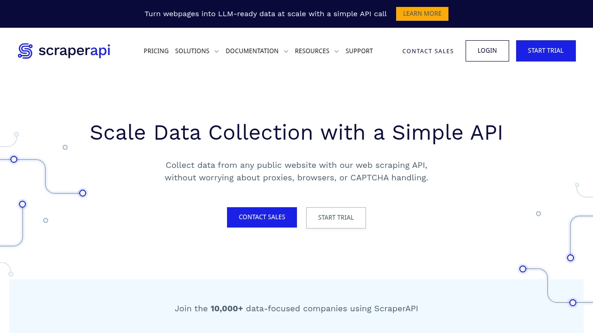
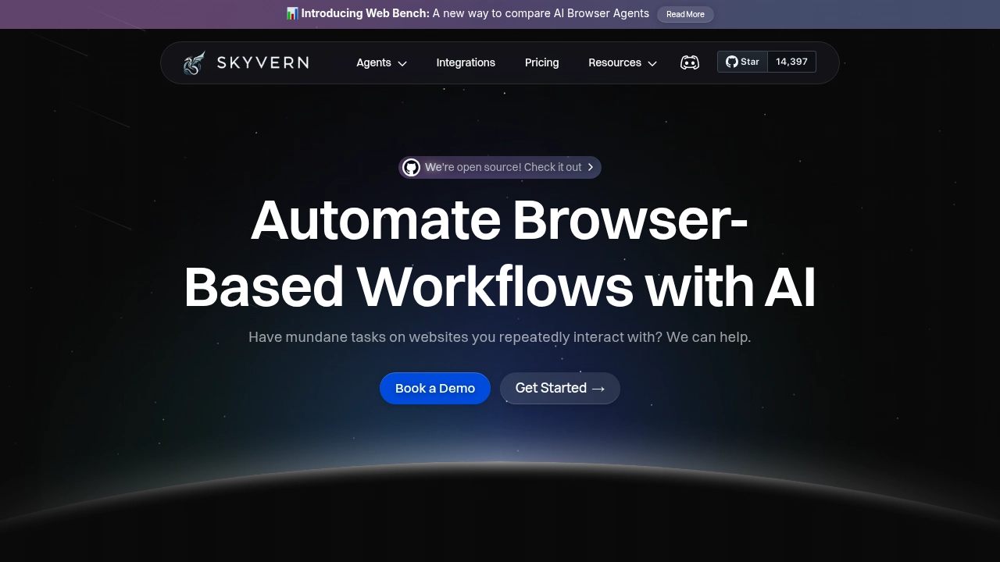
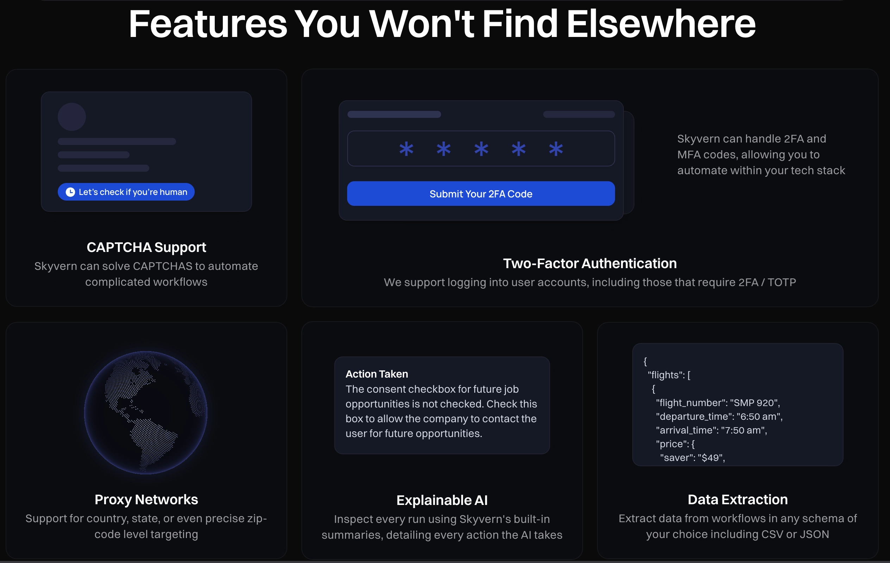
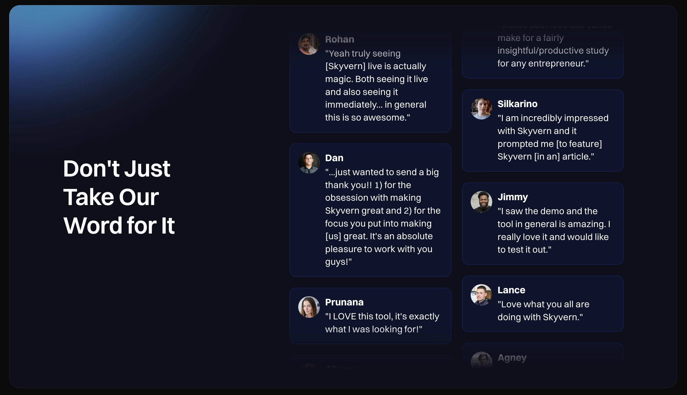

# ScraperAPI真的够用吗?2025年你该知道的替代方案

---

做了这么多年网页抓取,我见过太多公司在ScraperAPI这类传统API上碰壁。简单抓数据还行,但要做点复杂的浏览器自动化?就抓瞎了。现在AI抓取方案正在改变整个游戏规则。咱们今天就聊聊,为什么ScraperAPI对认真搞自动化的人来说不太够用,以及2025年有哪些更靠谱的选择。

---

## ScraperAPI到底是个啥

ScraperAPI说白了就是个网页抓取API,提供代理轮换、基础浏览器自动化和简单的验证码破解功能。它用积分制,你通过他们的API端点发HTTP请求,然后拿回目标网站的HTML内容。

服务包括反反爬机制、JavaScript渲染,还有针对亚马逊和谷歌这些大站的结构化数据端点。支持多国地理定位,请求失败了会自动重试。

听起来挺全乎?但问题在于,这玩意儿本质上只能提取数据,不是完整的工作流自动化。你花钱买的是个带轮换功能的HTTP代理服务。抓抓基础数据没问题,但想和网站来点真正的交互?那就力不从心了。

## ScraperAPI有什么功能

ScraperAPI提供跨数据中心、住宅和移动IP池的代理轮换,覆盖多个地理位置。服务包括自动验证码破解、交互内容的JavaScript处理,还有针对主流电商和搜索引擎网站的结构化数据端点,直接返回解析好的JSON。

积分消耗根据网站复杂度变化:普通网站1积分,电商网站5积分,搜索引擎一次就要25积分。API支持并发连接(有速率限制),还能通过webhook自动推送数据。

其他功能包括地理定位参数、自定义请求头支持,以及需要登录的场景下的会话保持。价格从每月49美元起步,但想用JavaScript处理和高级功能?得上商业套餐。

👉 [想了解更灵活的自动化方案?这里有更适合复杂场景的选择](https://www.scraperapi.com/?fp_ref=coupons)

> ScraperAPI的积分制度很容易让成本飙升,特别是抓取复杂网站时每次请求消耗5-25积分,这让业务量不稳定的公司很难预测成本。

对于简单的数据提取任务,这服务够用。但现代业务工作流需要的复杂自动化功能?它没有。你没法填大多数表单,处理不了复杂的身份验证流程,也不能自动下载文件。

## ScraperAPI的硬伤在哪

ScraperAPI有个大问题:响应时间极不稳定,可能几秒钟就完事,也可能等上40多秒。在抓取复杂目标时表现尤其拉胯——亚马逊的响应时间能飙到40秒,搜索引擎抓取成功率只有80%。

用户反馈说经常遇到超时,大批请求间歇性失败,在生产环境根本靠不住。

基础套餐的地理定位精度有限,JavaScript处理这类高级功能只在昂贵的商业套餐里提供。积分每月清零不能累积,对业务量波动的公司来说预算很难做。

最要命的限制是:ScraperAPI主要就是设计来提取数据的。你没法自动填表,处理不了双因素认证,也不能自动下载文件。这让它对需要真正和网站交互的复杂业务流程来说不太合适。

网站改版或者上新的反爬措施?你得手动更新抓取代码。这维护成本可不小,而现代AI方案早就解决这问题了。

## 比ScraperAPI更好的选择

**Skyvern**是ScraperAPI最好的替代品,特别是在浏览器自动化和数据提取方面。和ScraperAPI基于代理的方式不同,Skyvern用大语言模型和计算机视觉来自动化完整的网站工作流,能处理身份验证、表单填写和文件下载——远不止简单抓数据。

Skyvern能在从没见过的网站上工作,网站改版了也能自动适应,不需要更新代码或维护。这让它特别适合采购流程、发票处理这些复杂的业务任务。

市场上还有其他几个选择:

- **Bright Data:** 面向企业,代理网络覆盖广,价格偏高
- **Scrapingdog:** 注重性能,价格有竞争力,响应速度快
- **ScrapingBee:** 专攻验证码破解和JavaScript处理
- **Oxylabs:** 高端定位,代理服务可靠,数据解析结构化
- **ZenRows:** 性价比高,但在复杂网站上不太稳定
- **Apify:** 功能全面,自动化能力强,有个大型的actor市场

每个方案针对的场景不同,但大多数还是聚焦在基础数据提取,而不是完整的工作流自动化。Skyvern开源的特性提供了透明度和定制选项,这是专有API比不了的。

## 功能对比

对比不同方案如何处理各种自动化需求——从简单数据提取到复杂工作流自动化,你就能看清基础抓取和完整自动化之间的差距。特别是表单填写和身份验证支持这些功能。

大多数传统抓取API在网站改版时需要手动更新代码,而AI驱动的方案能自动适应。对于大规模运行自动化的公司来说,这是个大变化。

## 为什么Skyvern更适合浏览器自动化

ScraperAPI专注通过代理轮换做基础数据提取,Skyvern提供的是完整的浏览器自动化,能处理包括身份验证、表单填写和文件处理在内的全套工作流。Skyvern利用大语言模型和计算机视觉,能在从没见过的网站上操作,设计上就能抵抗网站布局变化。

这消除了传统抓取方式的维护负担和脆弱的选择器问题,对需要可靠、可扩展自动化方案的公司来说很理想。你可以自动化求职申请、政府表单提交和复杂的采购流程,不用为每个网站写定制代码。

AI驱动的方式意味着,即使网站重新设计界面或上了新的安全措施,你的自动化也能继续运行。👉 [传统抓取API在网站改版时就歇菜了,但像这样的智能方案能自动适应](https://www.scraperapi.com/?fp_ref=coupons)。

对于要从简单数据提取升级到真正工作流自动化的公司来说,选择很明确。你需要一个能思考、能适应、能处理真实业务流程复杂性的方案。

## 常见问题

### ScraperAPI和Skyvern这类AI自动化工具主要区别是什么?

ScraperAPI专注通过代理轮换和HTTP请求做基础数据提取,AI工具提供的是完整工作流自动化,包括表单填写、身份验证和文件下载。AI方案还能在网站改版时自动适应,不需要更新代码。

### ScraperAPI的价格和其他方案比怎么样?

ScraperAPI起步价每月49美元,用积分制,复杂网站每次请求消耗5-25积分,成本很难预测。像Skyvern这样的替代方案用API调用计费,而Bright Data这类高端服务企业功能起步价在几百美元一个月。

### ScraperAPI能处理表单填写和身份验证吗?

不能,ScraperAPI只能提取数据,填不了表单,处理不了双因素认证,也不能自动下载文件。要实现这些功能,你需要能真正和网站交互的完整浏览器自动化方案,不只是简单抓取。

### 为什么传统抓取API在网站改版时就不行了?

像ScraperAPI这样的传统API依赖预设的选择器和静态代码,网站重新设计布局或上新的安全措施时就过时了。这需要手动更新代码,持续维护,不像AI方案能自动适应。

### 什么时候该考虑从ScraperAPI换到更高级的方案?

如果你需要自动化数据提取之外的完整工作流,处理身份验证和表单填写,或者想省掉网站改版时更新抓取代码的维护麻烦,那就该考虑AI驱动的浏览器自动化替代品了。

---

## 关于ScraperAPI和网页抓取替代品的最后说两句

ScraperAPI做基础数据提取还行,但现代业务经常需要的功能远不止带代理轮换的简单HTTP请求。当你要处理需要填表、身份验证和文件下载的复杂工作流时,传统抓取API就跟不上了。Skyvern通过自动适应网站变化消除了维护的麻烦,让你把精力放在业务发展上,而不是修复挂掉的脚本。网页自动化的未来已经来了,它由真正理解你想做什么的AI驱动。
